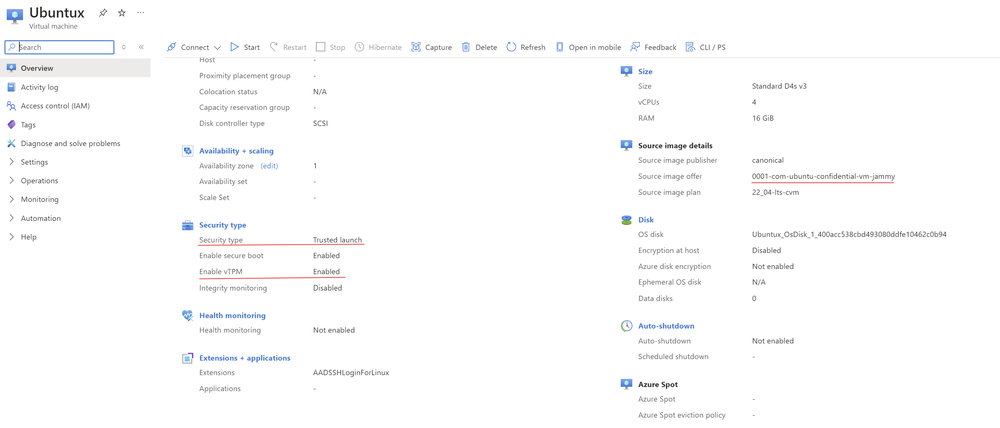

# Implementation of DCR (Data Clean Room)

> ##  Secure Multiparty Data Sharing with Confidential Computing

Data Clean Rooms provide a secure environment for collaborative data analysis without revealing private user information. They allow multiple parties to combine data for better insights while maintaining privacy. By anonymizing data within controlled spaces, Data Clean Rooms reduce privacy risks and ensure compliance with regulations. This approach enables richer data analysis and more accurate models while respecting user trust.

Confidential computing leverages Trusted Execution Environments (TEEs) like Intel® TDX and SGX. These enclaves create secure spaces within processors, protecting data confidentiality and integrity even if the system is compromised. Think of it as having locked vaults inside your computer for processing sensitive information. Confidential computing is ideal for Virtual Machines (VMs), enabling secure data processing on shared hardware.

Confidential computing relies on Trusted Execution Environments (TEEs) built into modern processors like Intel® SGX and TDX. These TEEs act like secure vaults within the processor, protecting data confidentiality and integrity even in a compromised system.

Here's how to achieve confidential computing:
- Leverage cloud platforms or hardware that supports TEEs.
- Develop your application to utilize TEE libraries (e.g., Intel SGX SDK).
- Design your code to process sensitive data within the secure TEE enclave.
- TEEs handle computations, keeping your data encrypted and isolated from the rest of the system.

Cloud Confidential VMs offer a simpler approach to confidential computing compared to local setups. Here's why:

- Pre-configured Environment: Cloud providers manage the TEE infrastructure, eliminating the need for local installation and configuration of TEE libraries.
- Scalability and Flexibility: Cloud VMs offer easy scaling based on your needs, while local setups might require additional hardware investment.
- Security Expertise: Cloud providers have expertise in securing their infrastructure, potentially enhancing overall security compared to a local environment.
While local setups offer more control, cloud Confidential VMs provide a quicker and potentially more secure option for leveraging TEEs.

Using Azure Cloud Confidential VM ?
- Pre-built Security: Utilize pre-configured VMs with built-in TEE (Trusted Execution Environment) technology like Intel SGX or AMD SEV-SNP.
- Simple Setup: Skip local TEE library installation and configuration complexities.
- Secure Enclave: Isolate sensitive data processing within the secure enclave of the TEE, protecting confidentiality and integrity.
- Scalability: Easily scale your resources up or down as needed based on your workload.
- Cloud Expertise: Benefit from Microsoft's security expertise for a potentially more secure environment.


Azure confidential virtual machines FAQ about is security and confidentiality.
- https://learn.microsoft.com/en-us/azure/confidential-computing/confidential-vm-faq

Choose a Confidential VM offering: Azure offers various Confidential VM configurations with Intel SGX or AMD SEV-SNP support. Select a VM size that meets your processing needs and budget.

## Create a Cloud Confidential VM:

Azure Portal:
- Navigate to the "Virtual Machines" service in the Azure portal.
- Click "Add" to create a new VM.
- Select your chosen Confidential VM offering and configure settings like size, storage, and networking.
- During configuration, enable features like "Trusted Launch" or "Secure Enclave" depending on the chosen TEE technology (SGX or SEV-SNP).



Link to setup Azure Cloud Confidential VM : 
>https://azuremarketplace.microsoft.com/en-us/marketplace/apps/canonical.0001-com-ubuntu-confidential-vm-jammy?tab=overview

Configure Network Security:
- Implement security groups on your VM to restrict inbound and outbound traffic, ensuring only authorized communication occurs.

Install Software:
- Connect to your Azure VM using Remote Desktop or SSH.
- Install the necessary software stack for your data clean room functionality. This might include:
- Python and data science libraries (Pandas, scikit-learn) for data handling and anonymization.
- TEE libraries specific to your chosen technology (Intel SGX SDK or AMD SEV libraries) for secure data processing within the enclave.
- Containerization tools like Docker to package your application components for easier management.

### Using Docker Containers:

- Isolation: Docker containers provide additional isolation for your data clean room application, further enhancing security.
- Portability: Docker images package your application and its dependencies, simplifying deployment across different environments.
- Resource Management: Containers share the underlying operating system of the VM, optimizing resource utilization.

#### Setup Docker 

```sh
# Add Docker's official GPG key:
sudo apt-get update
sudo apt-get install ca-certificates curl
sudo install -m 0755 -d /etc/apt/keyrings
sudo curl -fsSL https://download.docker.com/linux/ubuntu/gpg -o /etc/apt/keyrings/docker.asc
sudo chmod a+r /etc/apt/keyrings/docker.asc

# Add the repository to Apt sources:
echo \
  "deb [arch=$(dpkg --print-architecture) signed-by=/etc/apt/keyrings/docker.asc] https://download.docker.com/linux/ubuntu \
  $(. /etc/os-release && echo "$VERSION_CODENAME") stable" | \
  sudo tee /etc/apt/sources.list.d/docker.list > /dev/null
sudo apt-get update
```

Install docker pkg's

```sh
sudo apt-get install docker-ce docker-ce-cli containerd.io docker-buildx-plugin docker-compose-plugin
```

## Container Image Development:

Develop Docker images that encapsulate your data clean room functionalities

### Docker Image Description : [Docker_Image](./Dockerfile)

This Docker image sets up a secure data clean room environment with the following components:

1. **Base Image and Tools**:
   - **Base**: Uses `ubuntu:22.04`.
   - **Tools**: Installs essential tools like `wget`, `curl`, `vim`, `git`, `python3.9`, `pip`, and `tpm2-tools`.

2. **Python and JupyterLab**:
   - **Python Libraries**: Installs `pandas` and `numpy` for data manipulation.
   - **JupyterLab**: Installs and configures JupyterLab for remote access.

3. **Intel SGX Setup**:
   - **SGX Packages**: Installs `sgx-dcap-pccs` and `sgx-pck-id-retrieval-tool` for creating secure enclaves.

4. **Node.js and PCCS Server**:
   - **Node.js**: Installs Node.js to run the PCCS server.
   - **PCCS Configuration**: Sets up PCCS server configurations and SSL keys.

5. **User Configuration**:
   - **User**: Adds a new user (`ubuntu`) with appropriate permissions.

6. **TPM Initialization**:
   - **Key Creation**: Creates TPM Endorsement Key (EK) and Attestation Key (AK).
   - **PCR Baseline**: Reads PCR values for integrity checks.

7. **Service Execution**:
   - Runs both JupyterLab and the PCCS server concurrently.

### Summary of Functionalities

- **Data Preprocessing and Analysis**: Includes `pandas` and `numpy` for data manipulation and analysis.
- **Secure Enclave Interaction**: Uses Intel SGX libraries for secure data processing.
- **Remote Attestation**: Uses TPM tools for environment integrity verification.
- **Optimized Builds**: Can be extended with multi-stage builds to reduce final image size.

This Docker image provides a comprehensive and secure setup for data processing and analysis within a confidential computing environment.

> ### How the tpm-tools will work  inside container Container 


1.  Setup Tools
```sh
sudo apt install tpm2-tools -y
```
2.  Create Endorsement Key (EK)
Initialize the TPM by creating an Endorsement Key:
```sh
tpm2_createek --ek-context rsa_ek.ctx --key-algorithm rsa --public rsa_ek.pub
```
3.  Create Attestation Key (AK)
Create an Attestation Key derived from the EK, used for signing quotes and attestations:
```sh
tpm2_createak \
   --ek-context rsa_ek.ctx \
   --ak-context rsa_ak.ctx \
   --key-algorithm rsa \
   --hash-algorithm sha256 \
   --signing-algorithm rsassa \
   --public rsa_ak.pub \
   --private rsa_ak.priv \
   --ak-name rsa_ak.name
```

4.   Save the AK's Public Key
Save the Attestation Key's public key from each confidential VM into a remote key/attestation server for future verification.

### PCR
Platform Configuration Registers (PCRs) are unique elements within the TPM2 that can only be updated using a hashing mechanism. This one-way update process guarantees the integrity of your code.

1.  Initialize PCR
First, read the PCR values to establish a baseline:

1.  Extending values into PCR
first we need to hash the data, then extend it to PCR
```sh
tpm2_pcrread sha1:0,1,2+sha256:0,1,2
```
Ensure both data and models are encrypted before uploading to the Trusted Execution Environment (TEE).

3.  Extend Values into PCR Indices
To ensure the integrity of a client's code, hash the code and extend it into the PCR.

Hashing Data
Replace CRITICAL-DATA with your actual data and code:
```sh
export SHA256_DATA=$(echo "CRITICAL-DATA" | openssl dgst -sha256 -binary | xxd -p -c 32)
export SHA1_DATA=$(echo "CRITICAL-DATA" | openssl dgst -sha1 -binary | xxd -p -c 20)
```
Verify the hash values:
```sh
# env | grep SHA1
SHA1_DATA=39739bfcd59c10bc8b220398a4c868dbe41c455c

# env | grep SHA256
SHA256_DATA=ab805369897acf5a4536130b2d8799d6bcb9506de0f490b656ff7037f360a005
```
4.  Extending to PCR
Extend the hash values to the PCR:
```sh
tpm2_pcrextend 0:sha1=$SHA1_DATA,sha256=$SHA256_DATA
tpm2_pcrextend 1:sha1=$SHA1_DATA,sha256=$SHA256_DATA
tpm2_pcrextend 2:sha1=$SHA1_DATA,sha256=$SHA256_DATA
```
Read the PCR values again to verify the extension:
```sh
tpm2_pcrread sha1:0,1,2+sha256:0,1,2
```

5.  Create Quote from PCR Values
Define a 'golden state' PCR, which represents the 'good state' of the software and data, using the tpm2_quote tool. This should be done in a trusted execution environment like the confidential VM.
```sh
export SERVICE_PROVIDER_NONCE="12345678"

tpm2_quote \
--key-context rsa_ak.ctx \
--pcr-list sha1:0,1,2+sha256:0,1,2 \
--message pcr_quote.plain \
--signature pcr_quote.signature \
--qualification $SERVICE_PROVIDER_NONCE \
--hash-algorithm sha256 \
--pcr pcr.bin

export GOLDEN_PCR=$(cat pcr.bin | openssl dgst -sha256 -binary | xxd -p -c 32)
```
6.  Evaluate PCR Values

Verify the Quote
Verify the quote to ensure the integrity and authenticity of the environment:

```sh
export SERVICE_PROVIDER_NONCE="12345678"

tpm2_checkquote \
--public rsa_ak.pub \
--message pcr_quote.plain \
--signature pcr_quote.signature \
--qualification $SERVICE_PROVIDER_NONCE \
--pcr pcr.bin
```

## Setting Up a Remote Key/Secret Server
- To verify authenticity and integrity, you need a remote key/secret server. In this case, using an **Azure Key Vault** makes sense.
- Here's how to set it up:
     1. Log in to the Azure portal.
     2. Create a new resource: Key Vault.
     3. Fill out the necessary fields, ensuring that Azure Virtual Machines can access secrets.
     4. Review and create the Key Vault.
     5. Alternatively, you can create an Azure Key Vault using the command line:
        ```sh
        az keyvault create --name <your-key-vault-name> --resource-group <your-resource-group> --location <your-location>
        ```
     6. Define proper policies to restrict access based on your multi-party data sharing scenario.

#### Sending Evidence to the Remote Key/Secret Server:
   - Access the Key Vault using Azure SDKs, CLI, or REST API.
   - Import an existing Attestation Key (AK) into the Key Vault:
     ```sh
     az keyvault key import --vault-name <your-key-vault-name> --name <your-key-name> --pem-file mykey.pem
     ```

#### Getting the Encrypted Wrapper Key via TLS from the Key Server into the Clean Room (TEE):
   - Download the encrypted wrapper key from the Key Vault using Azure CLI:
     ```sh
     az keyvault key download --vault-name <your-key-vault-name> --name <your-key-name> --file <path-to-save-key>
     ```
   - Use this key to decrypt the model and data within the TEE.

#### Encrypting Output Data Leaving the Clean Room
   - Modify your code to run the encryption function on specified files.
   - Return the encrypted files to permitted users, providing them with model insights and synthetic data.

---

Sources

- https://gist.github.com/kenplusplus/f025d04047bc044e139d105b4c708d78#file-gistfile1-md
- https://github.com/cc-api/confidential-cloud-native-primitives/blob/main/container/pccs/Dockerfile
- https://github.com/Azure/confidential-computing-cvm-guest-attestation?tab=readme-ov-file
- https://learn.microsoft.com/en-us/azure/confidential-computing/confidential-vm-faq