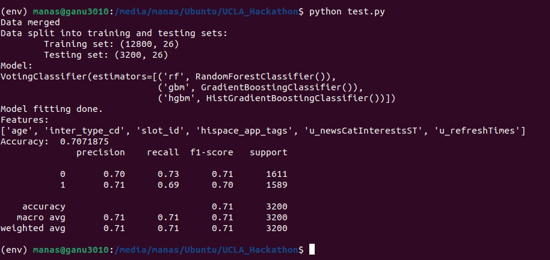

## Task 2: Machine Learning Predictor

# Predictive Model for Identifying Potential Customers

## Objective

# Identifying Potential Customers

Ad agencies aim to develop a predictive model to identify potential customers from the overall audience. The model will:

## Requirements for the Model:
- Achieve high accuracy and precision in identifying potential customers.
- Be scalable to handle large datasets.
- Be robust enough to manage diverse and noisy data.

## Data and Tools Used:
- Historical audience interaction data.
- Machine learning frameworks and algorithms (e.g., TensorFlow, scikit-learn).
- Data preprocessing and feature engineering techniques.

## Outcome:
A trained model that accurately distinguishes potential customers from non-customers within a given audience.

## Incorporating Diverse Attributes
To enhance prediction accuracy, the model will utilize a comprehensive set of attributes:

### Demographics:
- Age
- Gender
- Income level
- Education
- Geographic location

### News Content Attributes:
- Topics of interest
- Engagement with specific types of news articles
- Reading frequency and patterns

### Advertisement Attributes:
- Types of ads interacted with
- Frequency and duration of ad interactions
- Preferred ad formats (e.g., video, banner)

### Device Attributes:
- Type of device used (e.g., mobile, desktop)
- Operating system
- Browser type
- Time of access

## Probability Prediction
The model will predict the probability that a given audience member will become a potential customer:

### Model Outputs:
- Probability score indicating the likelihood of an individual becoming a customer.
- Confidence intervals to measure prediction certainty.

### Applications:
- Personalized advertising campaigns targeting high-probability customers.
- Optimized resource allocation for marketing efforts.
- Enhanced customer segmentation for better engagement strategies.

## Implementation Details

### Data Collection
#### Sources:
- Web analytics
- CRM systems
- Third-party data providers

#### Compliance:
- Ensuring data privacy and compliance with relevant regulations (e.g., GDPR).

### Data Preprocessing
#### Steps:
- Cleaning and normalizing data to handle missing values and inconsistencies.
- Feature engineering to create meaningful attributes from raw data.

### Model Training
#### Process:
- Split the data into training and testing sets.
- Train various models such as RandomForestClassifier, GradientBoostingClassifier, and VotingClassifier.
- Use Sequential Feature Selector (SFS) for feature selection.

### Model Evaluation
#### Metrics:
- Accuracy
- Precision
- Recall
- AUC-ROC

### Deployment
#### Integration:
- Integrating the model into existing ad delivery platforms.

#### Real-Time Prediction:
- Setting up real-time prediction pipelines.

#### Monitoring:
- Continuous monitoring and retraining to adapt to changing audience behaviors.
